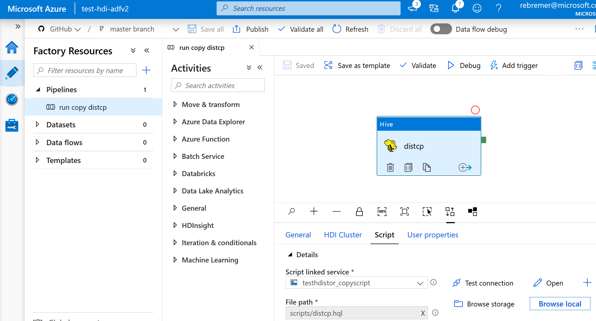

## Copy data with ADFv2 with distcp using On-demand HDInsight

Project that creates an ADFv2 On-demand HDInsight cluster to copy data using distcp. In this example, a source and sink blob storage account are used, however, an on-premises HDFS sink can be used as well (notice that HDFS sink is not supported in ADFv2 directly, see [here](https://docs.microsoft.com/en-us/azure/data-factory/copy-activity-overview#supported-data-stores-and-formats)). Following steps need to be executed:

1. Create a source [storage account](https://docs.microsoft.com/en-us/azure/storage/common/storage-account-create?tabs=azure-portal), create a container and add some files to this container. Similarly, create a sink storage account and create a container.
2. Create an On-demand HDInsight cluster as described in this [link](https://docs.microsoft.com/en-us/azure/hdinsight/hdinsight-hadoop-create-linux-clusters-adf). Additional steps to take to configure HDInsight cluster
  - As script action, add the url of this [script](https://raw.githubusercontent.com/rebremer/adfv2-hdfs-sink/master/HDInsight_actionscripts/link_source_sink_storage.sh). This scripts links the source and sink storage accounts to the cluster
  - As paramaters of the script, add the following ```<<source storage name>> <<source storage key>> <<source storage container>> <<sink storage name>> <<sink storage key>> <<sink storage container>> ```, replacing the variables with the correct ones create in step 1. 
3. Create a new adfv2 pipeline and add an HIVE activity. This hive activity will trigger a shell script containing a distcp copy command as follows: ```! hadoop distcp wasbs://<<source storage container>>@<<source storage name>>.blob.core.windows.net/ wasbs://<<sink storage container>>@<<sink storage name>>.blob.core.windows.net/ ```
  - It can also be decided to create a JAR activity, but shell script above needs to be embedded in a JAVA project
  - Instead of creating the ADFv2 pipeline yourself, [adfv2 folder](https://github.com/rebremer/adfv2-hdfs-sink/tree/master/adfv2) of this repo can also be imported in your adfv2 instance
4. Run the pipeline. Since the On-demand cluster needs to be spun up, it can take between 10-20 minutes before cluster is created and distcp command is triggered. See also below pipeline below:

